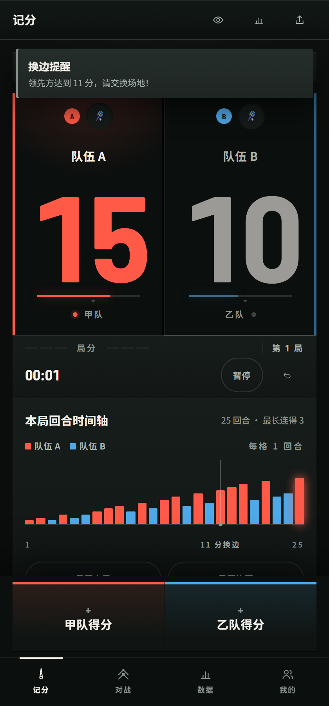
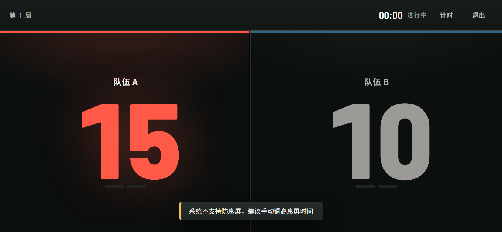

<div align="center">

<!-- Language Switcher -->
<p align="center">
  <a href="README.md">
    
  </a>
  <a href="README.zh-CN.md">
    
  </a>
</p>

<!-- Typing Title -->


<h3>🚀 The Ultimate Scoring & Management System for Badminton Lovers</h3>

<p align="center">
  
  
  
</p>

<p align="center">
  
  
  
</p>

---

[🌐 Live Demo](https://tryworld2026.github.io/badmintonrapidscoreboard/) | [✨ Features](#-features) | [🚀 Quick Start](#-quick-start) | [❓ FAQ](#-faq)

</div>

## 🌟 Why It's Exceptional?

This is more than just a scoreboard; it's a comprehensive ecosystem for managing your badminton activities.

<p align="center">
  
  
</p>

<table>
<tr>
<td width="33%">

### 💎 Pure Aesthetics
**Night Court**  
The whole scoreboard is a court: the centre line is the net, the outer edges are the sidelines, and the leading side receives a pool of its own team colour.

</td>
<td width="33%">

### 📱 Courtside Mode
**Readable from 2 metres**  
Scores scale to 179px. Tap either half to score, long-press to undo, with automatic screen-wake lock.

</td>
<td width="33%">

### 📊 Deep Insights
**Data-Driven Analysis**  
Integrated with Chart.js to track cumulative win rate, win/loss split, monthly volume and duration distribution — analyzing your game beyond just numbers.

</td>
</tr>
<tr>
<td width="33%">

### 👥 Smart Scheduling
**Fair Grouping Algorithm**  
Supports Random, Balanced, and Rotation modes. Rotation picks the next round's lineup — whoever has played least goes on, and you can see at a glance who is resting.

</td>
<td width="33%">

### 💰 Bill Master
**One-Click Cost Splitting**  
Built-in AA calculator for court fees, shuttles, and drinks. Generate and share beautiful bills instantly.

</td>
<td width="33%">

### 🔐 Zero-Risk Privacy
**Works fully offline**  
Data lives in your browser's LocalStorage by default. No account required, and scoring never issues a network request.

</td>
</tr>
</table>

---

## ✨ Core Features

### 🏸 Professional Scoring System
- **Real-time Timer**: Precisely record the duration of every match.
- **Undo Mechanism**: Step back through the point log to undo accidental score touches.
- **Round timeline**: every point becomes a bar — the x-axis is the rally number, bar height is the score after that rally, and a rule marks the round where the sides changed. Momentum, streaks and turning points in one glance.
- **Auto-Judgment**: Handles Deuce up to 30 points, strictly following BWF rules.
- **Victory FX**: Stunning full-screen effects and achievement unlock notifications.

### 👥 Intelligent Grouping & Finance
- **Multiple Modes**: Random, Skill-Balanced (strong-weak pairing), and Round Robin.
- **Expense Calculator**: Set totals, split by head, or use custom ratios. Copy results with one click.

### 📺 Courtside Mode
- **Giant readout**: scores scale to 179px in landscape — roughly 2.2 m of comfortable reading distance.
- **Half-screen buttons**: each side is a full-height tap target, so you can hit it without looking.
- **Gestures**: tap to score, long-press (>520ms) to undo the last point.
- **Screen wake lock**: keeps the display awake, and re-acquires automatically after backgrounding.
- **Degrades safely**: if fullscreen, orientation lock or wake lock is unavailable, scoring still works.

### 📊 Personal Performance Profile
- **Player Profile**: Core stats, four rankings, recent form and auto-generated tags for every player.
- **Leaderboards**: Real-time rankings based on win rate, matches played, and duration.
- **Achievement System**: 12 beautifully designed badges tracking your journey from "Rookie" to "Badminton King".

---

## 🎨 Visual Design

One purpose-built dark theme, tuned for a dim gym — there is no theme picker.

**The design premise**: the phone is propped courtside, the player stands 2 metres away, one hand sweaty, the other holding a racket. Every rule below follows from that.

The design language is **"NIGHT COURT"**, and it follows from five rules:

1. **Light is not a border.** Every surface is "two gradient stops + a top inner highlight", never "a flat fill + a 1px stroke". On a dark background a 1px grey line is invisible, and an invisible boundary is no boundary at all — which is exactly where v3's "instrument readout" language failed: once `--sh-flat` became `none`, every panel collapsed into one dead grey slab.
2. **One protagonist.** The score is the only oversized element in the app. Every label is ≤11px with widened tracking, and never competes with the numerals.
3. **Two lines define a match.** The centre line is the net (a bright line with dark gutters either side, drawn with `box-shadow`); the outer edges are the sidelines. Team colour appears only on lines, numerals and light pools — never as decoration.
4. **A match has one shape.** The point feed became a **round timeline**: the x-axis is the rally number, bar height is the score after that rally, and a single rule marks the round where the sides changed. You read momentum and turning points at a glance instead of reading a list of "10 → 11".
5. **Motion serves scoring only.** A point lands the numeral in (one frame of white flash, then a hard drop from 1.07 to 1 — no bounce), while a neutral band of light sweeps across the scoring side. Every other interaction is ≤120ms or absent.

- 🌑 **Night-court green**: `#0A0D0C` base, `#0B0F0E` board, three layered surfaces. Not pure black (team colours overshoot blue on pure black), not fluorescent (glare under gym lighting).
- 🎯 **Team identity**: shuttle-cork red `#FF5A47` vs court blue `#4FA8E8` — the **only** saturated colours in the UI, and only on sidelines, scores and light pools.
- 🟡 **Amber means exactly one thing**: **in progress**. It used to double as the "selected" state, so "this match is live" and "this button is selected" looked identical; selection is now expressed with ivory or a light pool.
- 🔢 **Numerals first**: `tabular-nums` for scores and timers, so digits don't jitter as they change.
- 🔤 **The font ships with the app**: scores use **Barlow Semi Condensed** (SIL OFL, bundled — 3 weights, 68 KB total). Three hard reasons: at 140px its digits are 74.9px wide, 4% narrower than the DIN it replaced (a half-court is only 194px, so a narrower face means a larger score); it carries `tnum`, so digits don't jitter as they change; and its OFL licence permits redistribution.
  Chinese still uses system faces (PingFang SC / Noto Sans SC) with the `unicode-range` pinned to Latin — which is why 68 KB covers the whole UI instead of a multi-megabyte CJK subset.
- 🟢 **Leading is shown by light**: the leading side receives a pool of its own team colour and its sideline brightens, while the trailing side is the same white ink dimmed to 62%. No outlines, no glowing icons, no colour swap.
- ♿ **Accessibility**: every touch target ≥ 44×44 (verified across 11 views, zero exceptions), WCAG AA contrast throughout, with focus trapping and screen-reader announcements.

### Deliberately removed

v2 spoke a "broadcast truck" language: `#D4FF3F` high-voltage fluorescent, `clip-path` chamfers, scanlines, italic Impact numerals, glowing outlines — all removed in v3.

v3 then over-corrected: in the name of "no glow" it switched every shadow off and replaced them with 1px hairlines, so the panels vanished into the dark background. v4 puts the light back, but only one kind of light: a single key light from above. The same pass removed v3's **tick ring** — those 40 precision ticks around each score were handsome, but they mapped to no real rule and were pure decoration. That space now carries the game progress line, whose tick sits on the actual side-change point (11 in a 21-point game, 8 in a 15-point game, 6 in an 11-point game).

The full v4 design system, the point-by-point reconciliation table and the implementation corrections are recorded in [`docs/redesign-v4/index.html`](docs/redesign-v4/index.html) (open it directly in a browser).

---

## 🚀 Quick Start

### Option A: Instant Use (Recommended) ⭐
Click the [Live Demo](https://tryworld2026.github.io/badmintonrapidscoreboard/) link to start your first match directly in your browser.

Also mirrored on Cloudflare Pages (same build, HTTPS + edge cache):

| Address | Notes |
|---|---|
| https://badminton.tryworld.com.cn/ | Custom domain on the `tryworld.com.cn` zone, proxied |
| https://badminton-score.pages.dev/ | Default `*.pages.dev` domain |

### Option B: Local Deployment
```bash
# Clone the repository
git clone https://github.com/TryWorld2026/badmintonrapidscoreboard.git

# Enter the directory
cd badmintonrapidscoreboard

# Start with Python (Recommended for best PWA experience)
python -m http.server 8000
```

---

## 🛠️ Tech Stack

Built on the **"Vanilla First"** principle, achieving powerful features with minimal footprint:

- **Core**: HTML5, CSS3 (Modern Flex & Grid), ES6+ JavaScript
- **Charts**: [Chart.js](https://www.chartjs.org/) - Powerful data visualization
- **Rendering**: [html2canvas](https://html2canvas.hertzen.com/) - High-quality share card generation
- **Fonts**: Barlow Semi Condensed (SIL OFL, bundled — see `fonts/`)
- **Storage**: LocalStorage — 10 keys, all on-device

---

## 🧪 Regression Tests

The project ships a zero-dependency regression suite: it opens an iframe loading the **real** `index.html`, so assertions run against the shipped artifact itself (the same `App` namespace, the same DOM) rather than a DOM stand-in — a stand-in only proves the stand-in works.

### Option A: Command line (recommended; this is what CI runs)

```bash
node tools/run-tests.js
```

It starts its own static server (automatically stepping to the next port if one is taken) and reports via **exit code**: `0` for green, `1` for any failure or runtime error. Drop it into CI or a pre-commit hook.

### Option B: In the browser

```bash
# Must be served over http (under file:// the iframe cannot reach App cross-origin,
# and the Service Worker never registers)
python -m http.server 8899

# Then open in a browser
# http://127.0.0.1:8899/test.html
```

The cases cover scoring rules, saved-state normalization, expense splitting, overlays, visual tokens, courtside mode and the PWA — each traced back to a defect that was actually fixed, specifically guarding against the class of bug that regresses silently: a switch that exists but never participates in the decision.

Currently **30/30 passing**. Every case has been through **two-way mutation testing** — deliberately reintroducing the original defect to confirm the case really turns red. This is not ceremony: during this round of work, two cases initially **could not detect the bug they were written for** (a synthetic `click` never reaches the `pointerdown` path; the token audit silently skipped a newly added CSS file). Mutation testing caught both on the spot.

### Token consistency audit

```bash
node tools/audit-tokens.js
```

Scans every CSS / JS / HTML file for tokens that are referenced via `var(--x)` but never defined. These fail silently — the property just falls back to an inherited value — which makes them the easiest thing to miss during a visual refactor. This refactor leaned on it to catch three (`--fw-black`, `--dock-h`, `--z-highlight`).

### UI quality audit

```bash
node tools/audit-ui.js
```

Walks 11 views plus 5 courtside viewports and reports four classes of "no error thrown, but the experience is already broken":

| Check | Why it matters |
|---|---|
| Touch targets < 44×44 | One hand sweaty, the other holding a racket — a target you can't hit is a button that doesn't exist |
| Horizontal / vertical overflow | A horizontal scrollbar on a small screen is the most common mobile mishap |
| Legacy colour residue | The easiest thing to miss after a visual refactor is a hardcoded value somewhere |
| Courtside reading distance | Converted into "readable from how many metres" via the standard signage rule |

Current result: **all 11 views pass** (zero undersized targets, zero overflow, zero legacy colour), and courtside mode is comfortably readable at **2.0–2.2 m** in landscape.

---

## 🤝 Contributing

We warmly welcome developers to join us!

1. **Fork** the repo
2. **Create** your feature branch (`git checkout -b feature/AmazingFeature`)
3. **Commit** your changes (`git commit -m 'Add some AmazingFeature'`)
4. **Push** to the branch (`git push origin feature/AmazingFeature`)
5. **Open** a Pull Request

---

## 📄 License

This project is licensed under the [MIT License](LICENSE). Feel free to use, modify, and distribute.

---

<div align="center">

### 👨‍💻 Author
**TryWorld**  
Love Coding, Love Badminton 🏸

[](https://github.com/TryWorld2026)

**If this project helped you, please give it a ⭐ Star!**


</div>
